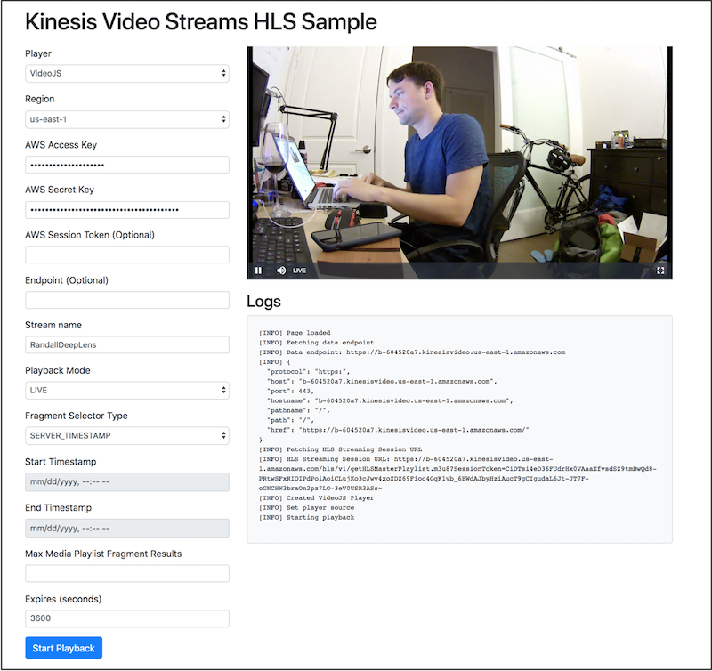

## Amazon Kinesis Video Streams HLS Viewer

Easily view HLS output of Amazon Kinesis Video Streams

* * *
## About
This is a simple static webpage that simplifies testing and experiments with HLS output from Amazon Kinesis Video Streams.

## Getting Started
The easiest and recommended approach is to use the Github-hosted version of this project. The second method is to clone/download this project and host it in your own S3 bucket or even locally.

### Using the Github-hosted UI
Because the project is a collection of static HTML and JavaScript, you can use the application without deploying the code into your own AWS account.

 To get started, go to the hosted [Kinesis Video Streams HLS Viewer](https://awslabs.github.io/amazon-kinesis-video-streams/).

 

## License Summary

This sample code is made available under a modified MIT license. See the LICENSE file.
